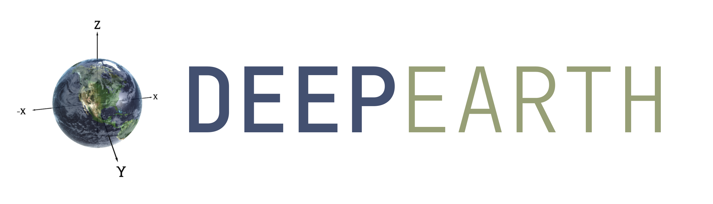
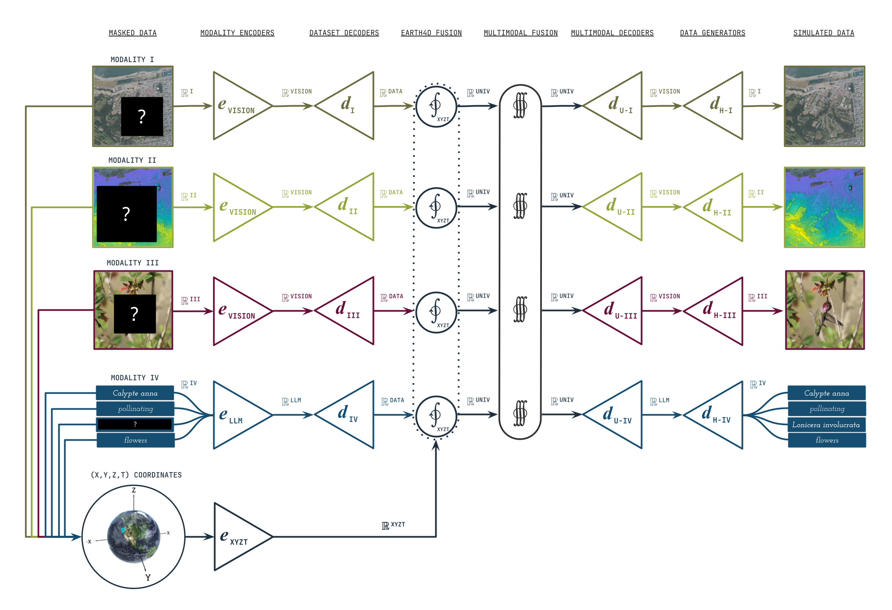
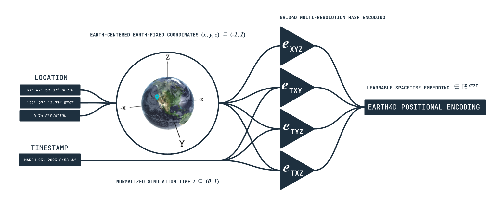

## DeepEarth: AI for Planetary Science & Sustainability

DeepEarth is a [self-supervised](https://en.wikipedia.org/wiki/Self-supervised_learning), [multi-modal](https://en.wikipedia.org/wiki/Multimodal_learning), [spatio-temporal](https://www.sciencedirect.com/topics/social-sciences/spatio-temporal-model) GeoAI model for global environmental intelligence and optimization.



DeepEarth learns by jointly reconstructing masked multi-modal datasets (as seen above). It uses a novel space-time positional encoder, [Earth4D](autoresearch/probes/spacetime/editable_files/README.md), especially for [earth observation](https://en.wikipedia.org/wiki/Earth_observation) data (as seen below).

 

> **Science status (2026-07-29):** historical Earth4D LFMC numbers below are exploratory, not confirmed
> state of the art. The old search reused the test set and its benchmark harness is absent. New Earth4D claims
> must pass the pinned temporal + held-site protocol in
> [`autoresearch/probes/spacetime/program/program.md`](autoresearch/probes/spacetime/program/program.md).

## How research runs here: granular probe loops first, fusion last

We build **backwards**. Each autonomous research loop owns **one probe and its own data**, and recovers
signal for one part of the science in [`autoresearch/science.md`](autoresearch/science.md). Only once
those signals are established do they get plugged into the fusion layer — the full model comes last.

```
                       ┌─────────────────────────────────────────────┐
   APEX                │  autoresearch/main/            FUSION       │   runs LAST
   consumes the        │  integrates the finished encoders           │
   probes' output      └──────────────────▲──────────────────────────┘
                                          │  depends on — the one legitimate edge,
                                          │  taken once the science is filled out
            ┌─────────────────────────────┴─────────────────────────────┐
   PROBE    │  autoresearch/probes/spacetime/    autoresearch/probes/biological/
   LOOPS    │  one probe · own data · own metric · own evals · own tests
            │  independent code · NEVER import a sibling
            └─────────────────────────────▲─────────────────────────────┘
                                          │  develops
            ┌─────────────────────────────┴─────────────────────────────┐
   LEAVES   │  .../spacetime/editable_files/   (Earth4D + CUDA hash)
            │  .../biological/editable_files/  (phylogenomic)
            └───────────────────────────────────────────────────────────┘
```

Read it bottom-up. An **encoder is a leaf** — the artifact under development — and it lives *inside* the
probe loop that develops it, because a leaf belongs to exactly one loop. A **probe loop** is the only
thing that changes its encoder, and never touches a sibling's. **`main` is the apex**: it consumes each
probe's finished encoder and runs last.

Dependencies point **upward only**. `main → probes` is legitimate and expected; `probe → sibling probe`
or `probe → main` is a cycle or a hidden coupling, and
either. Everything a loop owns lives under it: its program, its editable code, its encoder, its data, its
records, its tests. Nothing about a loop sits at the repository root.

Read it bottom-up: an **encoder is a leaf** — the artifact under development. A **probe loop** sits above
its encoder and is the only thing that changes it. **`main` is the apex**: it will consume each probe's
finished encoder, and it runs last. Dependencies point *upward only*. A probe importing a sibling probe,
or a probe importing `main`, is a cycle or a hidden coupling, and

each probe loop's `editable_files/` is still top-level rather than inside its probe loop. That consolidation waits until the
scientific performance is filled out — moving a CUDA build and its ABI-specific `.so` mid-campaign buys
nothing. The dependency direction is already correct; only the file location is provisional.

A fusion model trained before its constituent signals are established cannot tell you which part
works: it is confounded and slow, and every number it produces is a joint claim about everything at
once. A probe loop makes **one narrow claim, in minutes, against fair controls** — and a claim that
survives its own validation is what earns a place in fusion. So a probe loop's job is not to raise an
aggregate; it is to recover a real signal on one capability and prove the signal is the encoder's, not
borrowed from a frozen pretrained embedding.

Every loop keeps its fixed judge separate from its editable science, so scope is never ambiguous:

```
autoresearch/<loop>/
  program/                the contract: objective, scorecard, what counts as evidence
  harness.py or harness/  fixed runner, splits, controls, metrics, and records
  probe.py                fixed capability validation where applicable
  editable_files/
     earth4d.py or phylogenomic.py   public science entrypoint
     lib/                 modular scientific mechanisms composed by that entrypoint
  records/                harness-written board, traces, ledgers — never hand-edited
```

each probe loop's `editable_files/` stays top-level because it is the **interface** between the loops: a probe loop improves an
encoder, the fusion loop consumes it. Anything owned by one loop lives inside it — which is why the
fusion model moved from `core/` to `autoresearch/main/editable_files/fusion/`.

**Where the campaign stands:** [`autoresearch/scorecard.md`](autoresearch/scorecard.md) indexes every
loop's scorecard. Each loop publishes `program/scorecard.txt` — the current best per metric with its fair
gain and diagnosis, generated by that loop's harness after every run — beside a `scorecard.md` that
explains what the rows mean.

**Rules that hold across every loop** — see [`autoresearch/README.md`](autoresearch/README.md):
one probe per loop · no loop imports another loop's code · only the fusion loop touches the fusion
model · an experiment is an edit on a branch, never a new file or a new flag · a record from an
unpushed commit is discovery-only · `main` is reached only by a result that cleared its loop's evidence
bar.

## Exciting News:

- _March 7, 2026_  
  **Paper on arXiv.** [_"Self-Supervised Multi-Modal World Model with 4D Space-Time Embedding"_](https://arxiv.org/pdf/2603.07039), following peer-review through the [2026 World Modeling Workshop](https://world-model-mila.github.io/), is now on arXiv. See [_paper_](https://arxiv.org/abs/2603.07039).

- _January 28, 2026_  
  **Poster at World Modeling Workshop.** [Lance Legel](https://www.linkedin.com/in/legel/) and [Qin Huang](https://news.asu.edu/b/20250512-asu-phd-student-tackles-climate-change-and-extreme-weather) will present DeepEarth at the [2026 World Modeling Workshop](https://world-model-mila.github.io/). See [_poster_](docs/science/world_modeling_workshop_2026/poster/DeepEarth_2026_World_Modeling_Workshop_Poster.pdf).

- _January 14, 2026_  
  **Historical geospatial experiment.** A refined (_x_, _y_, _z_, _t_) = (_latitude_, _longitude_, _elevation_, _time_) coordinate system in [Earth4D](autoresearch/probes/spacetime/editable_files) showed a 4% exploratory benchmark gain; it still requires clean confirmation. See [_commit_](https://github.com/legel/deepearth/commit/4d21a32).

- _December 22, 2025_  
  **10x faster.** Following historical [Earth4D](autoresearch/probes/spacetime/editable_files/earth4d.py) experiments by [Brandon Voelker](https://www.egr.uh.edu/news/202410/space-ground-%E2%80%93-phd-student-voelker-leads-team-transforming-remote-sensing-based) on small batches, [Lance Legel](https://www.linkedin.com/in/legel/) sped up small batch processing by 10x. See [_commit_](https://github.com/legel/deepearth/commit/69f5be4e35c29df43c302bd3580b47d3911997e3).

- _December 19, 2025_  
  **Supercomputing award.** US DOE [National Energy Research Scientific Computing Center](https://www.nersc.gov) has awarded a DeepEarth team with supercomputing access in 2026 through [BER](https://science.osti.gov/ber).
  
- _December 2, 2025_  
  **Peer-reviewed presentation in top venue.** Accepted to the [2026 World Modeling Workshop](https://world-model-mila.github.io/) at the [Mila Quebec AI Institute](https://mila.quebec/en), alongside keynote talks by [Yoshua Bengio](https://yoshuabengio.org/) and [Yann LeCun](http://yann.lecun.com/). See [_paper_](docs/deepearth.pdf). 
  
- _November 17, 2025_  
  **Historical 99% parameter reduction, 4× speedup experiment.** [Earth4D](autoresearch/probes/spacetime/editable_files) with [learned hash probing](https://arxiv.org/abs/2312.17241) was explored on an [ecological benchmark](https://www.nature.com/articles/s41597-024-03159-6); exactness and accuracy must be revalidated under the current gate.

- _November 16, 2025_  
  **Historical 23% error-reduction result.** [Lance Legel](https://www.linkedin.com/in/legel/) and [Qin Huang](https://news.asu.edu/b/20250512-asu-phd-student-tackles-climate-change-and-extreme-weather) implemented [learned hash probing](https://arxiv.org/abs/2312.17241) in [Earth4D](autoresearch/probes/spacetime/editable_files). The reported benchmark R² was selected on test and is now treated as exploratory. See [_commit_](https://github.com/legel/deepearth/commit/aa2a4b7).

- _October 29, 2025_  
  **Predicting risk of fires.**  [Qin Huang](https://news.asu.edu/b/20250512-asu-phd-student-tackles-climate-change-and-extreme-weather), [Brandon Voelker](https://www.egr.uh.edu/news/202410/space-ground-%E2%80%93-phd-student-voelker-leads-team-transforming-remote-sensing-based), and [Lance Legel](https://www.linkedin.com/in/legel/) presented on simulating [live fuel moisture content](https://www.nature.com/articles/s41597-024-03159-6) through NSF's [Institute for Geospatial Understanding](http://i-guide.io/). See [_event_](https://i-guide.io/i-guide-vco/geospatial-simulation-of-fire-ecology-with-deepearth/).

- _October 27, 2025_  
  **Battle-hardened (_x_, _y_, _z_, _t_) AI.**  For our spatio-temporal [multi-resolution hash encoding](https://nvlabs.github.io/instant-ngp/), we've [fixed a numerical bug in NVIDIA's CUDA kernels](https://github.com/legel/deepearth/pull/7) based on profiling of hash collisions.

- _September 30, 2025_  
  **Presentation at top AI lab.** 
  Thanks to the [Allen Institute for AI](https://allenai.org) for hosting a 1 hour talk with scientists pioneering [AI foundation models for the planet](https://allenai.org/earth-system). See [_video_](  https://www.youtube.com/watch?v=SHJwCInICiA).

- _August 8, 2025_  
  **NSF summer school program.** NSF funded a week-long ["Spatial AI for Disaster Resilience"](https://i-guide.io/summer-school/summer-school-2025/) summer school program in Boulder, Colorado. 5 PhD students researched and developed DeepEarth.

- _June 23, 2025_  
  **Workshop in Chicago.** NSF funded a 3 hour workshop on DeepEarth in Chicago for a ["GeoAI for Sustainability"](https://i-guide.io/forum/forum-2025/workshops/) conference. 3 professors, 5 postdocs, and 2 PhD students contributed.

#### Planetary Intelligence for Everyone
DeepEarth is an open source project for solving intelligence across the planet 🌎. We aspire to help solve major sustainability challenges including [climate resilience and biodiversity](https://www.asla.org/climateandbiodiversityactionplan.aspx).

#### Invitation for Open Source Collaboration
Collaborators welcomed! Contact [Lance Legel](https://linkedin.com/in/legel) at lance@ecodash.ai or submit an issue/PR here.

For further details, see papers:
- [Self-Supervised Multi-Modal World Model with 4D Space-Time Embedding](https://arxiv.org/abs/2603.07039) (2026)
- [Inductive Neural Networks for Ecology](https://doi.org/10.13140/RG.2.2.25523.90406) (2025)
- [AI Foundation Models for Biogeography and Ecophysiology](https://doi.org/10.13140/RG.2.2.12102.13123) (2024)
