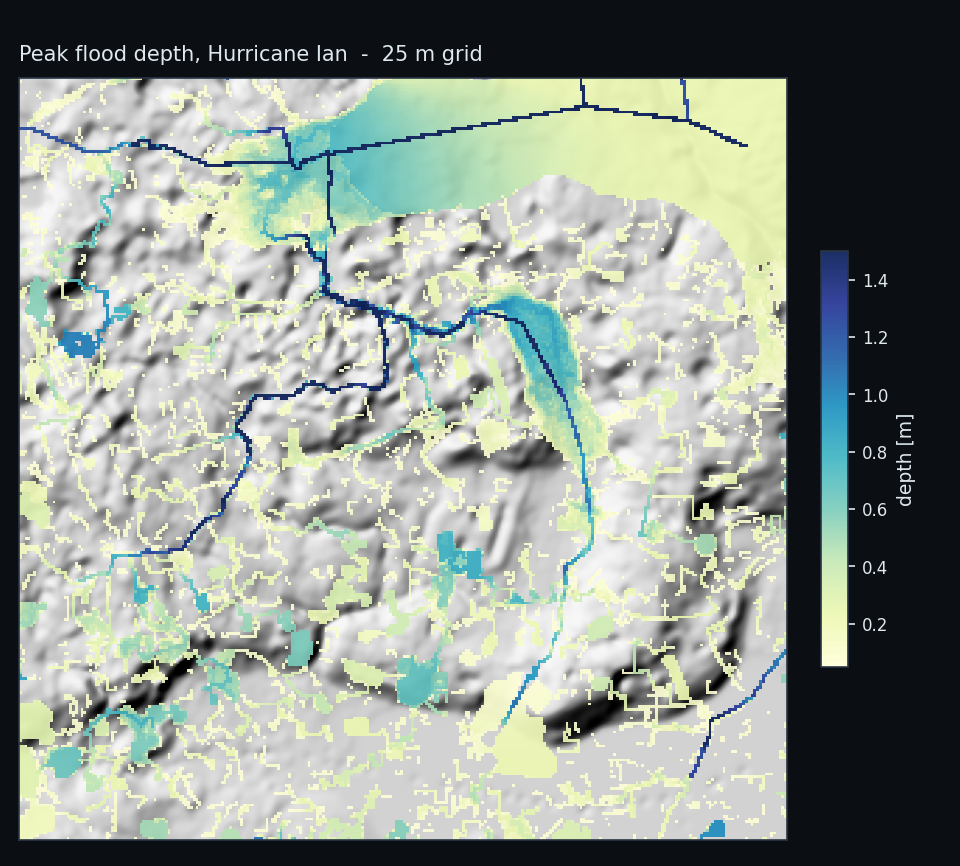
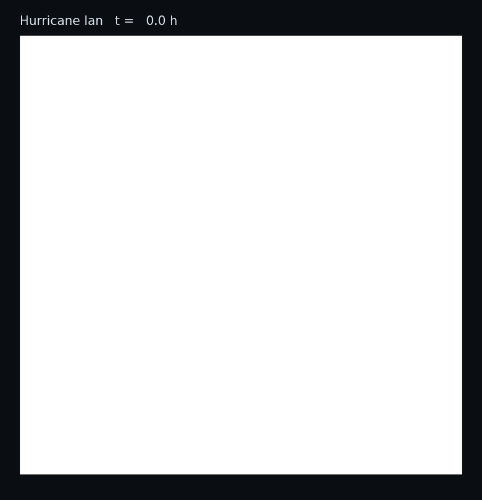
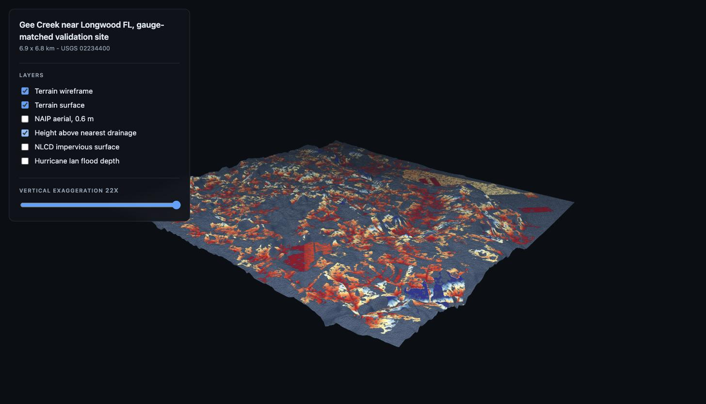

# Hydro

Turning **a coordinate** into a working flood digital twin: fetch every public dataset for that
location, condition the terrain, run a shallow-water solver over a real storm or a design-storm
ensemble, and serve the result as an interactive 3D scene.

Validated at Gee Creek near Longwood, Florida, against **USGS gauge 02234400** for Hurricane Ian.

[](docs/viewer_ian_peak.jpg)

Peak simulated depth, and the storm as it routes:

[](docs/flood_peak_ian.png)
[](docs/flood_ian.gif)

## The result

[](docs/hydrograph_ian.png)

| | model | observed | reading |
|---|---|---|---|
| rising limb, 50 % of peak | 31.86 h | 31.60 h | **0.26 h apart, 1.0× the gauge's own sampling interval** |
| runoff coefficient, 72 h | 70.79 % | 28.9 – 31.4 % | **2.3 – 2.5× overshoot — open** |
| mass-balance residual | −0.0008 % | — | conserves |
| Manning's *n*, scalar → field | 0.040 → 9.2× spread | — | roughness from imagery, not a survey |

Every input to that run was produced by `cli.py fetch` from the coordinate alone —
[`docs/reproduction_site3_ian_25m.json`](docs/reproduction_site3_ian_25m.json).

Both numbers survive a change of grid. At the 5 m production grid the runoff coefficient is
73.99 % against 71.35 % at the 25 m proxy, so the magnitude gap is not a grid artefact — and
25 m runs in ~6 minutes against ~15 hours, which is what makes it a usable proxy. Only the 25 m
run is shipped as an artefact; the 5 m figures quoted here and below are from a production run
that takes ~15 hours to reproduce. Flood *extent* does not transfer that way; see Limitations.

**Timing is effectively solved. Magnitude is not, and is stated as an open problem.** Seven
mechanisms have been tested and none closes it: roughness by three independent methods, soil
storage capacity, infiltration access, capacity and access combined, domain-versus-watershed
area (which points the wrong way), antecedent moisture, and gridded MRMS rainfall against the
point gauge. That is a real result, not a missing calibration.

A caveat that travels with every number here: this project's D8 delineation recovers **3.72 of
the gauge's documented 33.15 km²** — about **11 %** of the real contributing area. Central
Florida's depression-dominated flats only connect isolated wetlands to the channel network
during high-water events, so D8 under-captures badly. (An 11.65 km² figure appears in older
write-ups; it predates the stream-burn and threshold fixes and should not be quoted —
[`docs/terrain_site3.json`](docs/terrain_site3.json) is what the terrain stage actually
produces.)

## How it works

```
coordinate
  ├── fetch      3DEP DEM · SSURGO soils · NLCD impervious · NAIP 0.6 m · 3DHP hydrography
  │              FEMA NFHL · OSM roads+buildings · ASOS rainfall · NWIS discharge · Atlas 14
  ├── terrain    stream burn → depression breach → D8 → accumulation → HAND → watershed
  ├── segment    SAM3 open-vocabulary classes → Manning's n, impervious fraction   (optional)
  ├── simulate   Bates et al. (2010) local-inertial solver, spatial Horton infiltration
  │              against a finite SSURGO soil store
  ├── ensemble   NOAA Atlas 14 design storms, T ∈ {1…500} yr → per-cell annual exceedance
  └── viewer     Flask + three.js
```

Height above nearest drainage, the conditioning stage's own product, in the viewer. Blue is the
channel network the storm fills; grey is where D8 could not resolve drainage at all:

[](docs/viewer_hand.jpg)

**Parameters, not solvers, are what stop flood twins being deployable anywhere.** Shallow-water
solvers are mature and portable; roughness, infiltration capacity and storage come from national
surveys that exist in a handful of countries. `surface.py` derives them instead from 0.6 m
imagery. The vision route reproduces the soil survey's basin
water budget to within 0.6 % while sharing almost no spatial structure with it — it agrees on how
much water the basin sheds and disagrees on where.

The most transferable finding is a failure. Riparian canopy closes over the creek, so nadir
imagery cannot see it and the classifier called 58.9 % of mapped channel cells `tree_canopy` —
the gauge cell itself 100 % — putting forest roughness on the channel bed and collapsing
gauge-cell discharge from 101.6 to 10.5 cfs. Invisible in any domain-wide statistic. **Any nadir
parameterisation will make this mistake wherever vegetation overhangs conveyance**, so the fix is
structural: a mapped feature outranks a spectral inference, extended to hydrography.

## Run it

```bash
cd models/hydro
python3 -m pip install --user -r requirements.txt

python3 cli.py fetch    --site site3 --storm ian   # ~15 min; NAIP is nearly all of it
python3 cli.py terrain  --site site3
python3 cli.py simulate --site site3 --storm ian --cell-size 25   # ~6 min; 5 m is ~15 h
python3 cli.py validate --site site3 --storm ian --cell-size 25
python3 cli.py export   --site site3 --storm ian --cell-size 25   # rebuild the viewer payload
python3 cli.py viewer   --site site3                              # http://127.0.0.1:5051
```

The viewer works straight after a clone — a 256×256 terrain, the Ian animation and the draped
overlays are committed, 14 MB in total. Everything else is regenerated. `export` is only needed
after a re-run: it is what keeps the committed payload from drifting away from the source it was
derived from.

```bash
python3 -m pytest         # 107 tests, ~10 s, no network and no site data
```

This was rewritten from an older implementation, so it is held to that one numerically.

**Solver:** at 25 m the Ian hydrograph matched the previous engine to **5.7e-14 m³/s** across
all 12,960 steps, with peak depth and flooded area bit-identical. That comparison was run against
an engine that is not in this repository, so what ships here is this engine's side of it —
[`docs/parity_site3_ian_25m.json`](docs/parity_site3_ian_25m.json) — and the residual is a
recorded historical measurement, not something a clone can re-derive.

**Terrain conditioning:** re-running the stream burn and depression breach from the raw DEM
reproduces the burned DEM, the conditioned DEM and the HAND surface **byte-for-byte**.

**The whole chain:** fetching every dataset for a fresh coordinate, conditioning it, and running
the storm has been done from scratch — a real DEM, real SSURGO map units (Horton *fc* spanning
0.0–56.4 mm/hr across the box, not a domain mean), real NAIP, real OSM, real gauge record — with
mass balance closing to **−0.00015 %**. That figure is from that run and is not carried by a file
here; the shipped 25 m run closes to **−0.00032 %**
([`docs/parity_site3_ian_25m.json`](docs/parity_site3_ian_25m.json)), which is the number a
clone reproduces.

**Two interpreters, and the split is forced.** `richdem`, which performs the depression
breaching everything downstream depends on, does not build on Python 3.11; `pysheds` needs
numpy < 2. So the pipeline runs on **3.9**. SAM3 ships in `transformers` 5.x, which needs ≥ 3.10,
so `cli.py segment` runs from a separate 3.11 environment and hands over a class raster. Do not
"simplify" this by swapping richdem: WhiteboxTools agrees on 87.9 % of flow directions but
yields a stream network at **IoU 0.29**, which would silently rewrite every watershed here.

## Limitations

- **Pluvial only.** No inflow boundary condition, so no channel overtopping from upstream.
- **No baseflow or channel storage**, so the recession is too fast — visible in the hydrograph.
- **Stationary.** Atlas 14 carries no climate trend; these are present-day probabilities.
- **Stream delineation is unstable on this terrain.** Two defensible breaching algorithms give
  networks agreeing at IoU 0.29, because with ~25 m of relief over 6.9 km, D8 routing turns on
  sub-millimetre differences. The delineated network carries more uncertainty than it looks.
- **Flood extent has no ground truth here.** The gauge constrains discharge, not extent.
- **Extent is strongly resolution-dependent, so the 25 m proxy cannot supply it.** The 9-storm
  ensemble at 25 m puts 27.1 % of the domain at some pluvial risk against 1.2 % at 5 m — a
  22.5× difference in area fraction, because coarse cells average away the micro-topography
  that concentrates water into channels. The frequency analysis itself is resolution-robust:
  log-linearity of depth against ln T is **R² = 0.970 at both resolutions**, and the current
  solver needs monotonicity enforced on **0 cells** against 1.40 % previously. So the *method*
  transfers and the *areas* do not; quote extent only from a production-resolution run. Latest
  ensemble: [`docs/ensemble_site3_25m.json`](docs/ensemble_site3_25m.json).
- Peak depth from a 5 m run is **not** quotable either: the solver traps water in sub-grid pits
  at fine resolution. Runoff coefficient and rising-limb timing are unaffected by both effects.

## Next

Magnitude will not close on another parameter sweep. The two directions that could move it are a
richer prior — per-segment retrieval of USDA, FEMA and NLCD values for each segmented polygon,
refined by a vision-language model rather than inferred from imagery alone — and learned
operators over the terrain graph, where a solver's fixed infiltration curves are replaced by
something differentiable and trained against real events.

## Licence

MIT, via the repository root [`LICENSE`](../../LICENSE).
