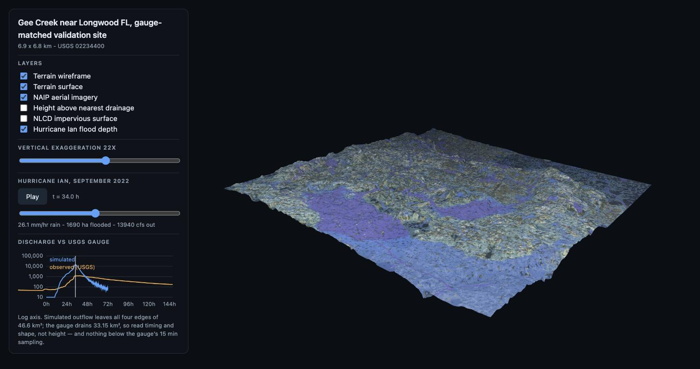
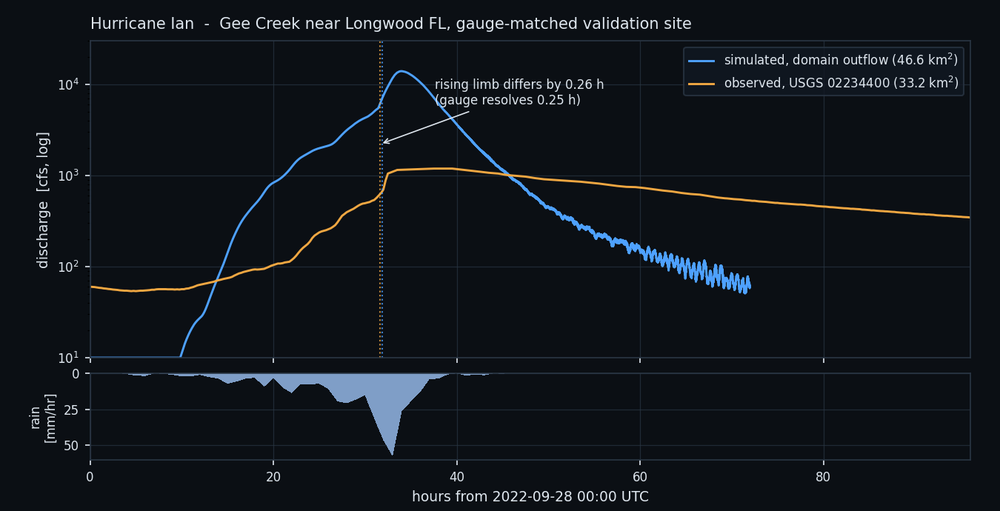

# Hydro

A 2D shallow-water model of storm runoff: rain lands on a terrain raster, infiltrates into a soil
whose state is carried cell by cell through time, and the excess routes under gravity and bed
friction. One sub-step is a handful of dense tensor operations in PyTorch, run on CPU or GPU.

Validated at Gee Creek near Longwood, Florida, against **USGS gauge 02234400** for Hurricane Ian.

[](docs/viewer_ian_peak.jpg)

## Equations

| process | equation | code |
|---|---|---|
| momentum, per face | $q^{n+1} = \dfrac{q^n - g h_f \Delta t\, \partial_x \eta}{1 + g \Delta t\, n^2 \lvert q^n \rvert / h_f^{7/3}}$, $\lvert q \rvert \le 0.9\, h_f \sqrt{g h_f}$ | [`solver.py` `_face_flux`](solver.py#L255) |
| continuity | $h^{n+1} = h^n + \Delta t\,(P + \nabla \cdot q) - i$ | [`solver.py` `_substep`](solver.py#L270) |
| time step | $\Delta t = \alpha\, \Delta x / \sqrt{g h_{\max}}$, $\alpha = 0.15$ | [`solver.py` `_cfl_dt`](solver.py#L248) |
| infiltration, ponded | $d - S \ln\!\left(1 + \dfrac{d}{F + S}\right) = K_s \Delta t$, $S = G(\theta_b, \theta_s)(\theta_s - \theta_b)$ | [`infiltration.py` `ponded_increment`](infiltration.py#L134) |
| infiltration, actual | $i = \min(d,\ h,\ F_{\max} - F_1 - F_2)$ | [`infiltration.py` `step`](infiltration.py#L167) |
| redistribution | $Z \dfrac{d\theta}{dt} = r - [K(\theta) - K(\theta_b)] - p\, K_s \dfrac{G(\theta_b, \theta)}{Z}$, $p = 1.7$ dry, $1.0$ wetting | [`infiltration.py` `_rate`](infiltration.py#L150) |
| conductivity | $K(\theta) = K_s S_e^{3 + 2/\lambda}$, $S_e = \dfrac{\theta - \theta_r}{\theta_s - \theta_r}$ | [`infiltration.py` `conductivity`](infiltration.py#L109) |
| capillary drive | $G(\theta_b, \theta) = \psi_f \dfrac{S_e^{c} - S_{e,b}^{c}}{1 - S_{e,b}^{c}}$, $c = 3 + 1/\lambda$ | [`infiltration.py` `capillary_drive`](infiltration.py#L114) |

The surface is the local-inertial approximation of Bates, Horritt and Fewtrell (2010), *J. Hydrol.*
387, 33-45, with Manning friction treated semi-implicitly. Infiltration is Green-Ampt with
redistribution (GAR): Ogden and Saghafian (1997), *J. Irrig. Drain. Eng.* 123(5), with the
redistribution equation of Smith, Corradini and Melone (1993), *Water Resour. Res.* 29(1), Brooks-Corey
hydraulics and the Rawls, Brakensiek and Miller (1983) texture table. It is the single-layer case of the
multi-front scheme NOAA's Next Generation Water Resources Modeling Framework runs as LGAR.

**The state bank.** Each cell carries `F1, θ1` (a deep wetting front), `F2, θ2` (a surface front a later
pulse starts over the drained deep one) and a hiatus flag ([`BANK`](infiltration.py#L47)). The bank
advances every sub-step, returns on `Result.soil_state` and seeds the next storm through
`Surface.soil_state`, so antecedent moisture is simulated rather than assumed. Without a `Surface.soil`
the solver runs Horton's decay against a finite soil store, the pipeline's SSURGO path.

**Every term in the budget is named.** [`MassBalance`](solver.py#L125) carries rain, initial, inflow and
`created` in; infiltrated, abstracted, stored and outflow out. `created` is what the positivity clamp
invents, reported rather than absorbed.

## Validation

**Against exact solutions** (`tests/`):

| check | result |
|---|---|
| ponded infiltration against Green and Ampt's implicit solution, three soils, Δt 1 s to 600 s | time error < 1e-9 of the run |
| light rain (r = K_s / 2) against an independent Radau solve of Smith et al. (1993), 6 h and 48 h | θ within 0.002 |
| rain and drainage into the bank, 3,000 intermittent steps | F₁ + F₂ equals water infiltrated to 1e-9 |
| a drained soil against a wet one, same storm | takes more than 5 % more, as redistribution predicts |
| Manning normal depth under edge inflow ([`docs/analytic_inflow.json`](docs/analytic_inflow.json)) | 9.63e-5 relative, mass 8.5e-15 |
| volume with rain, inflow, GAR or Horton, surface storage | closes to 1e-6 (float64), 1e-4 (float32) |
| lake at rest over an uneven bed | stays at rest to the bit |

**Against the gauge.** Hurricane Ian, 391.7 mm over 120 h, Horton on SSURGO
([`docs/validation_site3_ian_25m.json`](docs/validation_site3_ian_25m.json)):

[](docs/hydrograph_ian.png)

| | 25 m | 5 m | observed |
|---|---|---|---|
| peak discharge | 342.02 m³/s at 33.52 h | 314.78 m³/s at 33.52 h | 32.42 m³/s at 37.52 h |
| runoff coefficient | 0.800 | 0.796 | 0.289 to 0.314 |
| Kling-Gupta | −5.23 (r 0.54) | −4.75 (r 0.56) | |
| mass-balance residual | −0.00012 % | −0.197 % | |

The overshoot is the infiltration parameterization, not the grid: refining 5× moves the runoff
coefficient by 0.4 % ([`docs/resolution_site3_ian.json`](docs/resolution_site3_ian.json)). The Horton
fields cap infiltration at 19.30 % of the storm and the solver takes 18.64 %
([`docs/infiltration_ceiling_site3.json`](docs/infiltration_ceiling_site3.json)); a third of the
catchment has a soil store under 10 mm because SSURGO puts its seasonal-high water table at the surface.
GAR replaces that store with the soil's own water capacity above the water table, carried through time;
its Ian run is the next receipt here.

## How it works

```
coordinate
  ├── fetch      3DEP DEM · SSURGO soils · NLCD impervious · NAIP 0.6 m · 3DHP hydrography
  │              FEMA NFHL · OSM roads+buildings · ASOS rainfall · NWIS discharge · Atlas 14
  ├── terrain    stream burn → depression breach → D8 → accumulation → HAND → watershed
  ├── segment    SAM3 open-vocabulary classes → Manning's n, impervious fraction   (optional)
  ├── simulate   local-inertial solver, GAR or Horton infiltration, surface storage, edge inflow
  ├── ensemble   NOAA Atlas 14 design storms, T ∈ {1…500} yr → per-cell annual exceedance
  ├── validate   peak discharge, NSE, KGE against the gauge → JSON receipt
  └── viewer     Flask + three.js
```

## Run it

```bash
cd models/hydro
python3 -m pip install --user -r requirements.txt

python3 cli.py fetch    --site site3 --storm ian
python3 cli.py terrain  --site site3
python3 cli.py simulate --site site3 --storm ian --cell-size 25
python3 cli.py validate --site site3 --storm ian --cell-size 25
python3 cli.py viewer   --site site3                              # http://127.0.0.1:5051
```

```python
from infiltration import Soil
from solver import SolverConfig, Surface, simulate

soil = Soil.texture("silt loam", theta_i=0.20, shape=z.shape)          # or per-cell arrays
res = simulate(Surface(z=z, soil=soil, manning_n=n), rain_m_per_s, SolverConfig(dx=1.0, dt_s=60.0))
res = simulate(Surface(z=z, soil=soil, soil_state=res.soil_state), next_storm, cfg)   # the bank carries
```

```bash
python3 -m pytest         # 184 tests, no network and no site data
```

## Limitations

- **One soil layer.** GAR here has a single texture per cell; layered soils (LGAR) are the extension.
- **No baseflow or channel storage**, so the recession is too fast.
- **Flood extent has no ground truth here**, and it is resolution-dependent: the 25 m design-storm
  ensemble puts 27.1 % of the domain at some risk against 1.2 % at 5 m
  ([`docs/ensemble_site3_25m.json`](docs/ensemble_site3_25m.json)).
- **Stream delineation is unstable on flat terrain**, and the delineated area follows the resolution
  3DEP delivers ([`docs/terrain_site3.json`](docs/terrain_site3.json)).
- **Culverts are not routed.**

## License

MIT, via the repository root [`LICENSE`](../../LICENSE).
