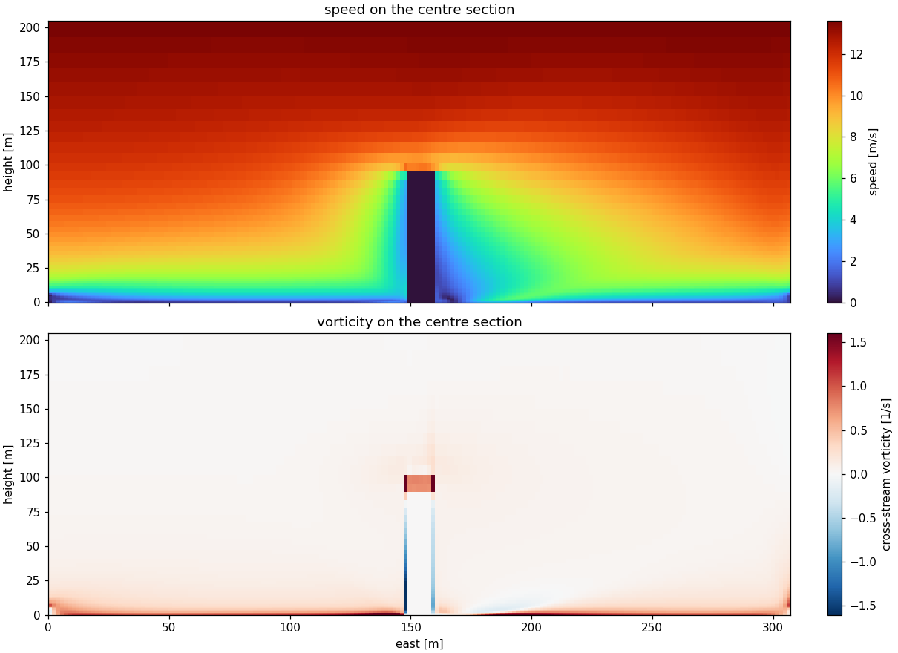

# Wind

A steady 3D wind field over terrain, buildings and canopy, in PyTorch. An upwind log profile is made
mass-consistent around the obstacles by a Poisson projection, then iterated to the steady state of the
momentum equations with advection, turbulent mixing, canopy drag and wall stress. The converged field does not
depend on the pseudo-time step. The full account, with every experiment and known error, is
[wind_simulation.md](wind_simulation.md).

[](docs/wind_tower_0.8m_section.png)

## Equations

| process | equation | code |
|---|---|---|
| inflow | $u(z) = \dfrac{u_*}{\kappa} \ln\dfrac{z - d}{z_0}$ from the reference speed | [`forcing.py` `LogProfile`](forcing.py#L24) |
| mass consistency | $\nabla^2 \lambda = \nabla \cdot \mathbf{u}^*$, $\mathbf{u} = \mathbf{u}^* - \nabla \lambda$ | [`solver.py` `project`](solver.py#L380) |
| steady residual | $R(\mathbf{u}) = -\sum_f F_f \mathbf{u}_f + \nabla\cdot(\nu_t \nabla \mathbf{u}) - (c_w + c_d a)\lvert\mathbf{u}\rvert\mathbf{u}$ | [`solver.py` `fv_increment`](solver.py#L557) |
| convection | face value $\mathbf{u}_f$ by MUSCL, van Leer limited, on the divergence-free face fluxes $F_f$ | [`solver.py` `convection`](solver.py#L536), [`_muscl`](solver.py#L198) |
| turbulent mixing | $\nu_t = (\kappa\, \bar h)^2 \lvert S \rvert + \nu$, under-relaxed 0.5 between steps | [`solver.py` `viscosity`](solver.py#L480) |
| canopy drag | $c_d\, a\, \lvert \mathbf{u} \rvert \mathbf{u}$, $a = \mathrm{LAI}/h$ | [`physics.py` `drag_density`](physics.py#L97) |
| wall stress | $\left(\kappa / \ln(\delta / z_0)\right)^2 \lvert \mathbf{u} \rvert \mathbf{u}$ at half a cell | [`solver.py` `_wall`](solver.py#L205) |
| pseudo-time step | $M\,\delta\mathbf{u} = \Delta t\, R(\mathbf{u}) + V \nabla \Pi$, $M = V(1 + \Delta t\, c\lvert\mathbf{u}\rvert) + \Delta t\,(D + A_\mathrm{upwind})$; then project, $\Pi \mathrel{+}= \lambda$ | [`solver.py` `run`](solver.py#L648), [`poisson.py` `Convective`](poisson.py#L154) |

Where $\delta\mathbf{u} = 0$ the steady equations hold whatever $\Delta t$, so the step only sets how fast the
iteration arrives. $M$ is solved by BiCGSTAB and the projection by conjugate gradients, both preconditioned by one
multigrid kernel; momentum runs in float32 and every projection in float64.

## Validation

Physics checks, float64, 1 m cells ([`docs/verification_cpu.json`](docs/verification_cpu.json)):

| check | measured | required |
|---|---|---|
| largest cell divergence, cube, ridge, flat | 3.4e-7, 1.9e-7, 2.7e-13 s⁻¹ | ≤ 1e-6 s⁻¹ |
| mass flux in against out | 2.3e-9, 1.0e-9, 3.4e-15 | ≤ 1e-6 |
| inflow profile returned by an unobstructed domain | 6.3e-6 of its peak | the discretization's own |
| speed inside canopy against none, LAI 0.5, 2, 8 | 0.967, 0.886, 0.702× | falling |
| wake behind an 8 m cube, min u / u(H) | −0.366, reversed in 12.7 % of the near wake | reversed |
| westerly against southerly over the same cube, rotated | 1.1e-5 | ≤ 1 % |
| field at 2, 5 and 10 m/s against one field scaled | 1.4e-5 | ≤ 2 % |

Step independence, Harvard Forest, one heading, 10.6 M cells: the published levels' medians at CFL 8, 32 and
64 against 16.

| level | CFL 8 | CFL 32 | CFL 64 |
|---|---|---|---|
| 4 m | +0.14 % | −0.40 % | −0.80 % |
| 10 m | +0.04 % | −0.14 % | −0.31 % |
| 25 m | 0.00 % | −0.05 % | −0.15 % |

The earlier semi-Lagrangian scheme's settled field depended on its step, and its medians sat 15 to 18 % below the
converged field at Harvard's four levels. The 1 m grid is not mesh-converged near the ground: a 2 m grid gives a
4 m median 29 % lower.

## Run it

```bash
cd models/wind
python3 -m pip install --user -r requirements.txt

python3 cli.py simulate  --site campanile --dx 0.8 --synthetic tower --speed 8 --direction 290 --cfl 16
python3 cli.py verify    --site campanile --cfl 16
python3 cli.py benchmark --site campanile --nx 128 --ny 128 --nz 64 --steps 5
```

`--bundle <dir>` solves a real site from a directory holding `semantics/class_top_<res>.tif` (a class per column)
with `parameters.json` (z0, cd, LAI and closure per class), and `surface/` DTM and DSM rasters; without one, the
46-class table in [`physics.py`](physics.py#L46) applies. `--fast` runs momentum in float32.

```bash
python3 -m pytest         # 86 tests, no network and no site data
```

## License

MIT, via the repository root [`LICENSE`](../../LICENSE).
