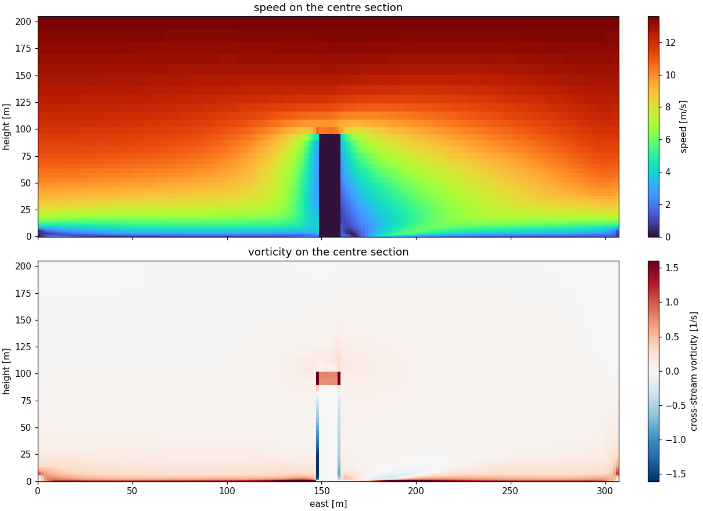

# Wind

A steady 3D wind field over terrain, buildings and canopy, in PyTorch. The sides carry the steady wind of a column
over the site's mean canopy; the field is made mass-consistent around the obstacles by a Poisson projection, then
iterated to the steady state of the momentum equations with advection, turbulent mixing, canopy drag and wall stress. The converged field does not
depend on the pseudo-time step. The full account, with every experiment and known error, is
[wind_simulation.md](wind_simulation.md).

[](docs/wind_tower_0.8m_section.png)

## Equations

| process | equation | code |
|---|---|---|
| upwind profile | $u(z) = \dfrac{u_*}{\kappa} \ln\dfrac{z - d}{z_0}$ from the reference speed, held at the top | [`forcing.py` `LogProfile`](forcing.py#L24) |
| inflow at the sides | the steady column over the site's mean canopy, $\dfrac{d}{dh}\left(\nu_t \dfrac{dU}{dh}\right) = (\bar{c_d a} + c_w)\,U^2$, at each cell's height above its ground | [`solver.py` `equilibrium_column`](solver.py#L500) |
| mass consistency | $\nabla^2 \lambda = \nabla \cdot \mathbf{u}^*$, $\mathbf{u} = \mathbf{u}^* - \nabla \lambda$ | [`solver.py` `project`](solver.py#L816) |
| steady residual | $R(\mathbf{u}) = -\sum_f F_f \mathbf{u}_f + \nabla\cdot(\nu_t \nabla \mathbf{u}) - (c_w + c_d a)\lvert\mathbf{u}\rvert\mathbf{u}$ | [`solver.py` `fv_increment`](solver.py#L1005) |
| convection | face value $\mathbf{u}_f$ by MUSCL, van Leer limited, on the divergence-free face fluxes $F_f$ | [`solver.py` `convection`](solver.py#L983), [`_muscl`](solver.py#L319) |
| turbulent mixing, as run (k-l) | $\nu_t = C_\mu^{1/4}\,\ell\sqrt{k}$; $\partial_t k + \nabla\cdot(\mathbf{u}k) = \nabla\cdot\left(\dfrac{\nu_t}{\sigma_k}\nabla k\right) + \nu_t\lvert S\rvert^2 - \dfrac{C_\mu^{3/4} k^{3/2}}{\ell} + c_d a\left(\beta_p\lvert\mathbf{u}\rvert^3 - \beta_d\lvert\mathbf{u}\rvert k\right)$; $C_\mu$ 0.09, $\sigma_k$ 1, $\beta_p$ 1, $\beta_d$ 5.1 (Katul et al. 2004); $\ell = \kappa(h_c - d)$ in the canopy, $\kappa(h - d)$ above, $d = 2h_c/3$ | [`solver.py` `k_step`](solver.py#L1063), [`KL_C_MU`](solver.py#L39), [`_kl_length`](solver.py#L332) |
| drive, as run | a mean pressure gradient along the wind, $\Pi = u_*^2 / h_{top}$ (the column's stress over its depth), no stress through the top | [`solver.py` `_kl_column`](solver.py#L555) |
| turbulent mixing, mixing length (option) | $\nu_t = (\kappa\, \bar h)^2 \lvert S \rvert + \nu$, under-relaxed 0.5 between steps | [`solver.py` `viscosity`](solver.py#L919) |
| canopy drag | $c_d\, a\, \lvert \mathbf{u} \rvert \mathbf{u}$, $a = \mathrm{LAI}/h$, only where the survey says plants stand | [`physics.py` `drag_density`](physics.py#L97), [`canopy.py` `apply`](canopy.py#L148) |
| where plants stand | a raised column is plants on multi-echo pulses (echo share $\ge 0.2$); a crown-class column is a structure, solid, where its echo share is under 0.05 or its top is a plane (surface variation $\lambda_{min} / \sum\lambda < 0.01$ over 3 m, Pauly, Gross and Kobbelt 2002), and it is not green ($(G - R)/(G + R) < 0.03$) | [`canopy.py` `evidence`](canopy.py#L96) |
| the ground in cut cells | a cell the terrain crosses stays open: its open volume $\theta_v$ holds the momentum, drag, drive and $k$, each side face passes flux through its open share $\theta_f$ above the bare earth, and the $z$-faces join the open parts' centres (FAVOR, Hirt and Sicilian 1985); a building keeps whole cells | [`solver.py` `_fractions`](solver.py#L448), [`domain.py` `PARTIAL_GROUND`](domain.py#L210) |
| wall stress | $\left(\kappa / \ln(d / z_0)\right)^2 \lvert \mathbf{u} \rvert \mathbf{u}$ at half a cell, and over the ground at the open part's mid height $d = (1 - \phi)\,\Delta z / 2$ over the true surface's area $\sqrt{1 + \lvert\nabla z_t\rvert^2}$ (Ye, Mittal, Udaykumar and Shyy 1999); a cut cell with $d < e\, z_0$ has no log layer of its own, and the cell above reads its surface at its true distance (Kawai and Larsson 2012) | [`solver.py` `_wall_coefficient`](solver.py#L686), [`_wall`](solver.py#L326) |
| ground the survey did not measure | the nearest measured ground blended into a Gaussian-smoothed fill with distance from the data | [`domain.py` `smooth_fill`](domain.py#L226) |
| pseudo-time step | $M\,\delta\mathbf{u} = \Delta t\, R(\mathbf{u}) + V \nabla \Pi$, $M = V(1 + \Delta t\, c\lvert\mathbf{u}\rvert) + \Delta t\,(D + A_\mathrm{upwind})$; then project, $\Pi \mathrel{+}= \lambda$ | [`solver.py` `run`](solver.py#L1178), [`poisson.py` `Convective`](poisson.py#L154) |

Where $\delta\mathbf{u} = 0$ the steady equations hold whatever $\Delta t$, so the step only sets how fast the
iteration arrives. $M$ is solved by BiCGSTAB and the projection by conjugate gradients, both preconditioned by one
multigrid kernel; momentum runs in float32 and every projection in float64.

## At every return: the Year's wind run

The solver is linear in the reference speed. An hour's field is the two solved headings about its direction $\theta$
blended and scaled to the reference speed $u_{ref}$, set by the tower ([wind_simulation.md](wind_simulation.md#how-the-tower-sets-the-value)):

| quantity | equation | code |
|---|---|---|
| speed at a return | $U(p, h) = u_{ref}(h)\,\lvert (1 - a)\,\mathbf{S}_k(p) + a\,\mathbf{S}_{k+1}(p) \rvert$, $\theta(h)$ between headings $k$ and $k + 1$, $a$ its fraction in steps of 1/16 | [`unit_field`](year_run.py#L42), [`groups`](year_run.py#L31) |
| wind run, km | $R(p) = 3.6 \sum_g \lvert \mathbf{S}_g(p) \rvert \sum_{h \in g} u_{ref}(h)$ over the year's hours grouped by heading pair and fraction | [`run_km`](year_run.py#L49) |
| stored | one byte a return, $\lfloor 254\, R / R_{\max} \rceil$, $R_{\max}$ the record's p98 over every year and return rounded up to 1, 2 or 5 times a power of ten | [`quantize`](year_run.py#L72), [`nice_ceil`](year_run.py#L61) |
| flow drawn over it | the year's typical hour, its most frequent 22.5° sector (calm under 0.5 m/s aside) at the sector's median speed, 2 m over each column's measured top | [`typical_hour`](year_run.py#L127), [`ribbon_field`](year_run.py#L140), [`ribbon_over_top`](year_run.py#L156) |

Grouping moves the run under 0.2 % (median) and 1 % (max) from summing every hour alone, over 8,760 random hours ([`tests/test_year_run.py`](tests/test_year_run.py)).

### The unit field at a return

Every return is read from the solver's 3D field, in the same `levels` run and from the same solves as the published
levels (`python3 cli.py levels --points <file> --points-out <dir>`), by one rule for every class:

| rule | equation | code |
|---|---|---|
| where it stands | its own $z$ less the two frames' median vertical offset (the survey's bare earth against the solver's, under the returns) | [`points.py` `datum_offset`](points.py#L340), [`place`](points.py#L349) |
| off the solids | read `CLEARANCE_M` (2 m) off every solid face it stands on or beside, along the solids' own outward normal, smoothed over 1 m; a crown return is read where it is, canopy being porous in the solve | [`CLEARANCE_M`](points.py#L30), [`GeometricNormals`](points.py#L152) |
| its value | $(u, v, w)$ trilinear over the fluid cell centres; a neighbor column whose top is within 1.5 cells is read at the same height over its own top, so a slope in cubes draws no contour lines | [`sample`](points.py#L376) |
| its speed | the norm of $(u, v, w)$ | [`run_km`](year_run.py#L49), [`read_points_basis`](year_run.py#L89) |
| a return the solve does not reach | the nearest reached return in $(x, y, z)$, carried to $z$ by the log law, clipped to a factor of 3 | [`fill_solids`](year_run.py#L106), [`FILL_MAX`](year_run.py#L25) |

The flow drawn over the Year is read the same way, 2 m over each column's measured top (its roof, or its crown's own
top where it carries canopy), with that height per cell, so a depth test hides a ribbon only behind something taller
than its own column (`python3 cli.py levels --over-top-out <dir>`; [`view.py` `over_top`](view.py#L314),
[`year_run.py` `ribbon_over_top`](year_run.py#L156)). From the framed view, on the lowest level 4 m over the bare earth,
0.14 % of Harvard Forest's ribbon cells and 33 % of UC Berkeley's were visible; over the top, 80 % and 85 %.

## Validation

Physics checks, float64, 1 m cells ([`docs/verification_cpu.json`](docs/verification_cpu.json)):

| check | measured | required |
|---|---|---|
| largest cell divergence, cube, ridge, flat | 3.4e-7, 1.9e-7, 2.7e-13 s⁻¹ | ≤ 1e-6 s⁻¹ |
| mass flux in against out | 2.3e-9, 1.0e-9, 3.4e-15 | ≤ 1e-6 |
| inflow profile returned by an unobstructed domain | 6.3e-6 of its peak | the discretization's own |
| speed inside canopy against none, LAI 0.5, 2, 8 | 0.967, 0.886, 0.702× | falling |
| wake behind an 8 m cube, min u / u(H) | −0.366, reversed in 12.7 % of the near wake | reversed |
| westerly against southerly over the same cube, rotated | 1.1e-5 | ≤ 1 % |
| field at 2, 5 and 10 m/s against one field scaled | 1.4e-5 | ≤ 2 % |

The ground in cut cells, on planes of 1 m cells, k-l and the mixing length, settled
([`tests/test_slope_ripple.py`](tests/test_slope_ripple.py)). On 1 m cubes a 6 % slope stands as 1 m risers every
17 m, and the solved wind waved at that period:

| check | measured | required |
|---|---|---|
| each cut cell's wall stress against the rough-wall log law over the true surface, slopes 0 to 30 % | to 1e-6 | exact |
| flat ground carried in cut cells (open 1, 0.9, 0.5, 0.2), surface $u_*$ against the log law's from the 10 m speed | +0.2 to +0.3 % (k-l), +1.2 to +1.8 % (mixing) | ≤ 5 % |
| a slope's surface $u_*$ from 1 m to 0.25 m cells, 6 and 15 % | 0.5 to 0.9 % | ≤ 5 % |
| the 2 m speed's ripple at the step period, 6 and 15 % | 1.0 % (whole cubes 2.2 to 3.3 %) | ≤ 2 % |
| a slope under a slope-parallel stream (flat ground rotated), surface $u_*$ against flat ground's | −2.2 % (6 %), −4.2 % (15 %) | ≤ 5 % |
| mass flux in against out | under 1e-6 | ≤ 1e-6 |

Under level air (the box's inflow, sides and top) the same slopes' surface $u_*$ stands +18 % and +43 % over the log
law's from their own 10 m speed, steady along a 480 m plane, with no pressure gradient to explain it. Over terrain the
log law with the local surface stress holds only within an inner layer of depth $l$,
$(l / L) \ln(l / z_0) = 2\kappa^2$ (Jackson and Hunt 1975), about 9 m here. Turned onto the slope, the same model
reads flat ground's $u_*$: the departure is the level air, not the cut ground. Carried as whole cells, cut cells had
read those slopes' $u_*$ 27 to 54 % over; with the fractions but read inside the roughness sublayer, it moved 10 %
as the cells shrank.

Step independence, Harvard Forest, one heading, 10.6 M cells: the published levels' medians at CFL 8, 32 and
64 against 16.

| level | CFL 8 | CFL 32 | CFL 64 |
|---|---|---|---|
| 4 m | +0.14 % | −0.40 % | −0.80 % |
| 10 m | +0.04 % | −0.14 % | −0.31 % |
| 25 m | 0.00 % | −0.05 % | −0.15 % |

The earlier semi-Lagrangian scheme's settled field depended on its step, and its medians sat 15 to 18 % below the
converged field at Harvard's four levels. With the column inflow the field changes at most 2.6 % between a 512 m and
a 768 m square; with a log-law inflow the canopy slowed the sides for hundreds of meters and the 4 m median fell 44 %
between 384 and 768 m ([wind_simulation.md](wind_simulation.md#experiments)).

## Run it

```bash
cd models/wind
python3 -m pip install --user -r requirements.txt

python3 cli.py simulate  --site campanile --dx 0.8 --synthetic tower --speed 8 --direction 290 --cfl 16
python3 cli.py verify    --site campanile --cfl 16
python3 cli.py benchmark --site campanile --nx 128 --ny 128 --nz 64 --steps 5
```

`--bundle <dir>` solves a real site from a directory holding `semantics/class_top_<res>.tif` (a class per column)
with `parameters.json` (z0, cd, LAI and closure per class), and `surface/` DTM and DSM rasters; without one, the
46-class table in [`physics.py` `CLASSES`](physics.py#L46) applies. `--fast` runs momentum in float32. A site is
solved with `--scheme fv --fast --inflow canopy --closure k-l --drive pressure`.

```bash
python3 -m pytest         # 191 tests, no network and no site data
```

## License

MIT, via the repository root [`LICENSE`](../../LICENSE).
